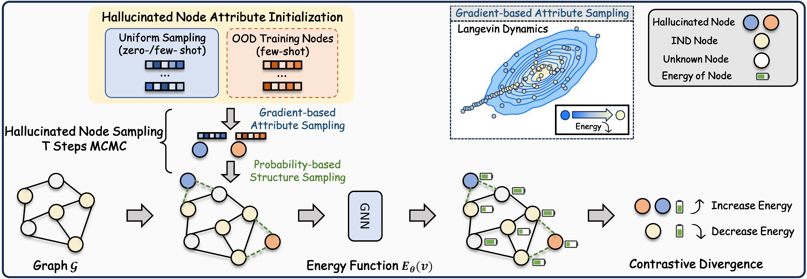

# EnergyDef

This is the source code of KDD'24 paper "An Energy-centric Framework for Category-free Out-of-distribution Node Detection in Graphs".

## Requirements
This code requires the following:
* Python==3.10.13
* dgl==1.1.3+cu121
* pyg-lib==0.3.0+pt20cu118
* torch==2.0.1+cu118
* torch-cluster==1.6.3+pt20cu118
* torch-scatter==2.1.2+pt20cu118
* torch-sparse==0.6.18+pt20cu118

## Data
The data will be automatically downloaded through our code.
